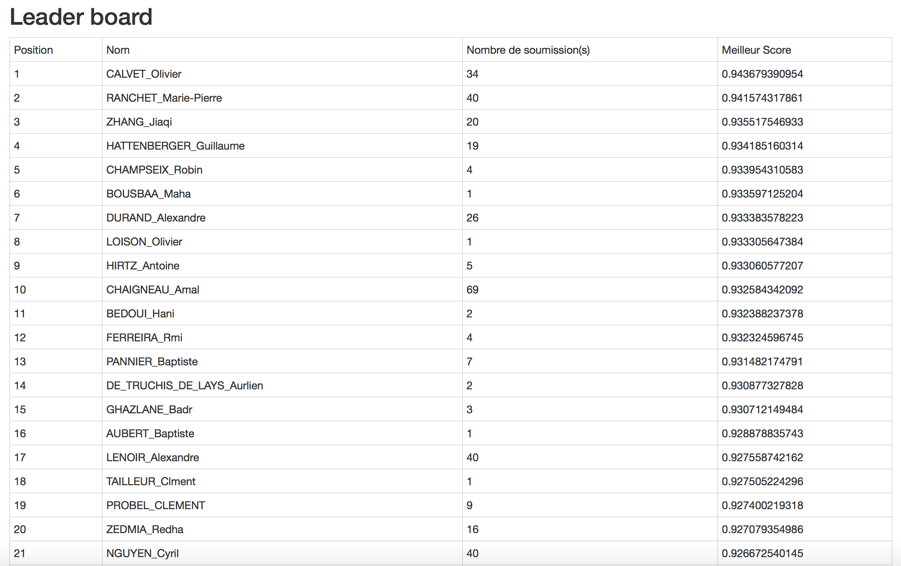
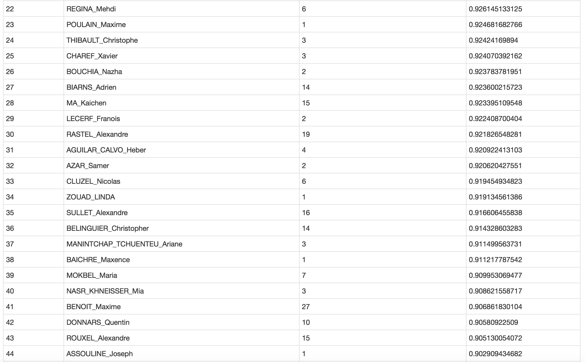
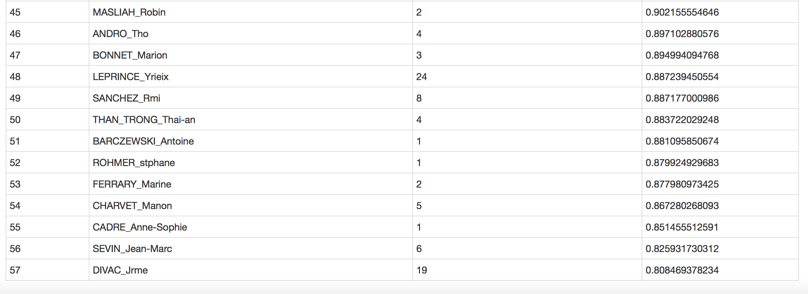

# Challenge : Image Classification

Course MDI341 - Advanced Machine Learning  
@ Telecom ParisTech (2017/2018)

## This challenge took place during our "Advanced Machine Learning" course at Telecom ParisTech and was part of the grade (40%) for this course.

The goal of this challenge is to develop a binary classification system which tries to detect if an image contains something or not.

It was first annonced to be a Mustache/No Mustache classification but after looking at some images, it seems the problem is more an Accessory/No Accessory issue. (More details in the Notebook)

-  The notebook *Challenge_ImageClassification_ADurand.ipynb* explains how I addressed this challenge with **Tensorflow**.

- *Layers.py* contains some useful functions for creating my CNN. (Those functions originally came from a Lab given by Stephane Gentric from IDEMIA, I reused them after some modifications for my needs).

==> I finally finished 7th on 57 students.

Here is the final ranking of the LeaderBoard :

